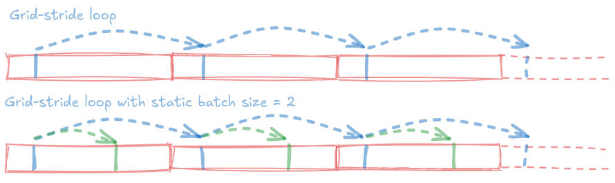

Further Performance Optimization
================================

In this chapter, we will discuss further ways to optimize performance. Different ideas involving varied settings have been collected here. We would like to highlight that these parameters should be tuned only to obtain extra performance gains, by exploiting problem specific structure and machine architecture. The values of these parameters need to be re-visited, when the user code is run in a new architecture. All these parameters have default values that don't enable the associated optimization.

Static Batch Size
-----------------

For now, this parameter concerns `RangePolicy <../API/core/policies/RangePolicy.html>`__ based execution of :cpp:`Kokkos::parallel_for` in CUDA and HIP backends. `StaticBatchSize <../API/core/Execution-Policies.html#other-arguments-for-certain-execution-policies>`__ is a compile-time template parameter of the execution policy. It is of scalar integer type, with default value 1.

In GPU backends, like CUDA and HIP, :cpp:`Kokkos::parallel_for` executes the one-dimensional iteration space specified by the :cpp:`Kokkos::RangePolicy`, using a `grid-stride loop <https://developer.nvidia.com/blog/cuda-pro-tip-write-flexible-kernels-grid-stride-loops/>`_. With a grid-stride loop, iteration spaces of any sizes can be handled. As shown in the figure, each thread handles multiple elements, by taking steps that are the size of the thread grid. By unrolling, we can make each thread process more elements, involving another smaller loop, before taking the bigger step. In the figure, we can see that for a static batch size of 2. Thus, the same iteration space is processed by a smaller number of threads, where each thread does more work. While the same amount of memory traffic is involved in both the cases, unrolling leads to better utilization of the computational resources on the GPU.

|node|

We have to keep in mind that grid-stride loop unrolling doesn't to lead data being shared between the unrolled indices. Thus, for problems with minimal or no data re-use like the Stream benchmark, one can obtain speed-up with static batch size > 1.

