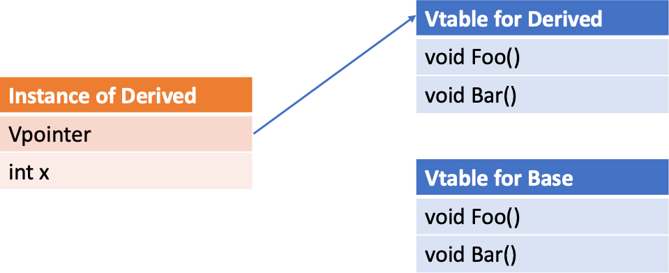

# 14. Kokkos and Virtual Functions

Due to oddities of GPU programming, the use of virtual functions in Kokkos parallel regions can be complicated. This document describes the problems you're likely to face, where they come from, and how to work around them.

## The Problem

In GPU programming, you might have run into the bug of calling a host function from the device. A similar thing can happen for subtle reasons in code using virtual functions. Consider the following code

```c++
class Derived : public Base {
  /** fields */
  public:
  KOKKOS_FUNCTION virtual void Bar(){
    // TODO: implement all of physics
  } 
};

Base* hostClassInstance = new Derived();
Base* deviceClassInstance;
cudaMalloc((void**)&deviceClassInstance, sizeof(Derived));
cudaMemcpy(deviceClassInstance, hostClassInstance, sizeof(Derived), cudaMemcpyHostToDevice);

Kokkos::parallel_for("DeviceKernel", SomeCudaPolicy, KOKKOS_LAMBDA(const int i) {
  deviceClassInstance->Bar();
});
```

At a glance this should be fine, we've made a device instance of a class, copied the contents of a host instance into it, and then used it. This code will typically crash, however, because `virtualFunction` will call a host version of the function. To understand why, you'll need to understand a bit about how virtual functions are implemented.

## V-Tables, V-Pointers, V-ery annoying with GPUs

Virtual functions allow a program to handle Derived classes through a pointer to their Base class and have things work as they should. To make this work, the compiler needs some way to identify whether a pointer which is nominally to a Base class really is a pointer to the Base, or whether it's really a pointer to any Derived class. This happens through Vpointers and Vtables. For every class with virtual functions, there is one Vtable shared among all instances, this table contains function pointers for all the virtual functions the class implements. 


Okay, so now we have Vtables, if a class knows what type it is it could call the correct function. But how does it know?

Remember that we have one Vtable shared amongst all instances of a type. Each instance, however, has a hidden member called the Vpointer, which the compiler points at construction to the correct Vtable. So a call to a virtual function simply dereferences that pointer, and then indexes into the Vtable to find the precise virtual function called.



Now that we know what the compiler is doing to implement virtual functions, we'll look at why it doesn't work with GPU's

Credit: the content of this section is adapted from Pablo Arias [here](https://pabloariasal.github.io/2017/06/10/understanding-virtual-tables/)

## Then why doesn't my code work?

The reason the intro code might break is that when dealing with GPU-compatible classes with virtual functions, there isn't one Vtable, but two. The first holds the host versions of the virtual functions, while the second holds the device functions. 


Since we construct the class instance on the host, so it's Vpointer points to the host Vtable.


Our cudaMemcpy faithfully copied all of the members of the class, including the Vpointer merrily pointing at host functions, which we then call on the device. 

## How to fix this

The problem here is that we are constructing the class on the Host. If we were constructing on the Device, we'd get the correct Vpointer, and thus the correct functions (but only for calls on the device). In pseudocode, we want to move from

```c++
Base* hostInstance = new Derived(); // allocate and initialize host
Base* deviceInstance; // cudaMalloc'd to allocate
cudaMemcpy(deviceInstance, hostInstance); // to initialize the deivce
Kokkos::parallel_for(... {
  // use deviceInstance
});
```

To one where we construct on the device using a technique called `placement new`

```c++
Base* deviceInstance; // cudaMalloc'd to allocate it
Kokkos::parallel_for(... {
  new((Derived*)deviceInstance) Derived(); // construct an instance in the place, the pointer deviceInstance points to
});
```

This code is extremely ugly, but leads to functional virtual function calls on the device. The Vpointer now points to the device Vtable.


Note that like with other uses of `new`, you need to later `free` the memory.
For a full working example, see [the example in the repo](https://github.com/kokkos/kokkos/blob/master/example/virtual_functions/main.cpp).

## Complications and Fixes

The first problem people run into with this is that they want to initialize some fields or nested classes based on host data before moving data down to the device

```c++
Base* hostInstance = new Derived(); // allocate and initialize host
hostInstance->setAField(someHostValue);
Base* deviceInstance; // cudaMalloc'd to allocate
cudaMemcpy(deviceInstance, hostInstance); // to initialize the deivce
Kokkos::parallel_for(... {
  // use deviceInstance
});
```

We can't translate this easily, the naive translation would be

```c++
Base* deviceInstance; // cudaMalloc'd to allocate it
Kokkos::parallel_for(... {
  new((Derived*)deviceInstance) Derived(); // initialize an instance, and place the result in the pointer deviceInstance
  deviceInstance->setAField(someHostValue);
});
```

Which would crash for accessing the host value `someHostValue` on the device (or this value would need to be copied into the `parallel_for`). The most productive solution we've found in these cases is to allocate the class in `SharedSpace`, initialize it on the device, and then fill in fields on the host. To wit:

```c++
Base* deviceInstance = Kokkos::kokkos_malloc<Kokkos::SharedSpace>(sizeof(Derived));
Kokkos::parallel_for(... {
  new((Derived*)deviceInstance) Derived(); // construct an instance in the place the the pointer deviceInstance points to
});
deviceInstance->setAField(someHostValue); // set some field on the host
```

This is the solution that the code teams we have talked to have said is the most productive way to solve the problem. Nevertheless, it should be kept in mind, that this restricts virtual function calls to the device.

## But what if I do not really need the V-Tables on the device side?
Consider the following example which calls the `virtual Bar()` on the device from a pointer of derived class type.
One might think this should work because no V-Table lookup on the device is neccessary.
```c++
#include <Kokkos_Core.hpp>
#include <cstdio>

struct Base
{
    KOKKOS_DEFAULTED_FUNCTION
    virtual ~Base() = default;

    KOKKOS_FUNCTION
    virtual void Bar() const = 0;
};

struct Derived : public Base
{
    KOKKOS_FUNCTION
    void Bar() const override
    { printf("Hello from Derived\n"); }

    void apply(){
        Kokkos::parallel_for("myLoop",10,
            KOKKOS_CLASS_LAMBDA (const size_t i) { this->Bar(); }
        );
    }
};

int main (int argc, char *argv[])
{
    Kokkos::initialize(argc,argv);
    {
      auto derivedPtr = std::make_shared<Derived>();
      derivedPtr->apply();
      Kokkos::fence();
    }
    Kokkos::finalize();
}
```
### Why is this not portable?

Inside the `parallel_for` `Bar()` is called. As `Derived` derives from the pure virtual class `Base`, the 'Bar()' function is marked `override`.
On ROCm 5.2 this results in a memory access violation.
When executing the `this->Bar()` call, the runtime looks into the V-Table and dereferences a host function pointer on the device.

### But if that is the case, why does it work with NVCC?

Notice, that the `parallel_for` is called from a pointer of type `Derived` and not a pointer of type `Base` pointing to an `Derived` object.
Thus, no V-Table lookup for the `Bar()` would be necessary as it can be deduced from the context of the call that it will be `Derived::Bar()`.
But here it comes down to how the compiler handles the lookup. NVCC understands that the call is coming from an `Derived` object and thinks: "Oh, I see, that you are calling from an `Derived` object, I know it will be the `Bar()` in this class scope, I will do this for you".
ROCm, on the other hand, sees your call and thinks “Oh, this is a call to a virtual method, I will look that up for you” - failing to dereference the host function pointer in the host virtual function table.

### How to solve this?
Strictly speaking, the observed behavior on NVCC is an optimization that uses the context information to avoid the V-Table lookup.
If the compiler does not apply this optimization, you can help in different ways by providing additional information. Unfortunately, none of these strategies is fully portable to all backends.

- Tell the compiler not to look up any function name in the V-Table when calling `Bar()` by using [qualified name lookup](https://en.cppreference.com/w/cpp/language/qualified_lookup). For this, you tell the compiler which function you want by spelling out the class scope in which the function should be found e.g. `this->Derived::Bar();`. This behavior is specified in the C++ Standard. Nevertheless, some backends are not fully compliant to the Standard.
- Changing the `override` to `final` on the `Bar()` in the `Derived` class. This tells the compiler `Bar()` is not changing in derived objects. Many compilers do use this in optimization and deduce which function to call without the V-Table. Nevertheless, this might only work with certain compilers, as this effect of adding `final` is not specified in the C++ Standard. 
- Similarly, the entire derived class `Implementation` can be marked `final`. This is compiler dependent too, for the same reasons.

## Questions/Follow-up

This is intended to be an educational resource for our users. If something doesn't make sense, or you have further questions, you'd be doing us a favor by letting us know on [Slack](https://kokkosteam.slack.com) or [GitHub](https://github.com/kokkos/kokkos)
